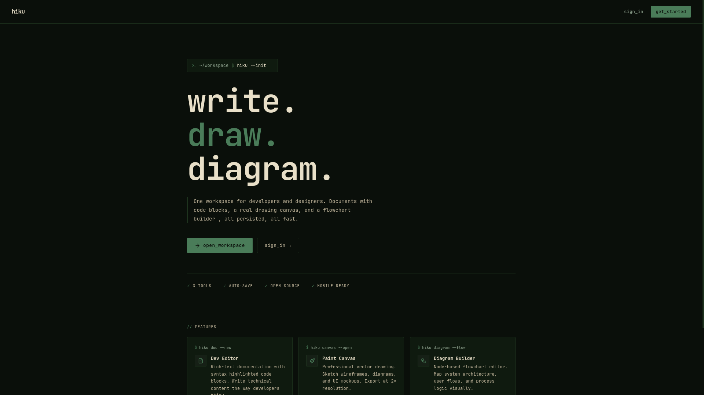
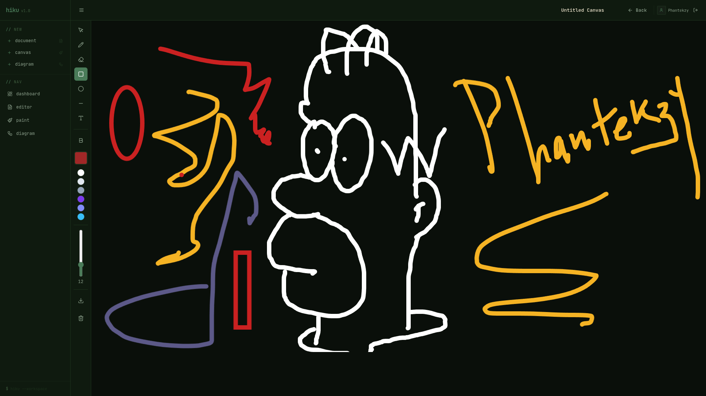

<!-- <p align="center">
  
</p> -->

<div align="center">
  <h1>Hiku: Write, Draw, Diagram</h1>
    <p>
        Hiku is a unified workspace engineered to consolidate essential software development tools into a single, high-performance interface. 
        It provides a streamlined, low-latency environment for drafting technical documentation, sketching architectural concepts, and mapping out system logic.
    </p>
  <br />
  
  
</div>

---
# System Capabilities

    *** Technical Editor: A dedicated space for technical documentation and engineering notes. Architected for future expansion into a fully integrated development editor featuring auto-completion and advanced syntax parsing.
    *** Paint Canvas: A minimal, low-latency rendering interface designed for rapid architectural sketching and visual brainstorming.
    *** Diagram Builder: A node-based utility for constructing flowcharts, mapping state machines, and visualizing component interactions across an application.


# Architecture & Stack

    * Frontend: React, TypeScript, Tailwind CSS

    * State Management: Zustand

    * Backend: Node.js, Express

    * Database: PostgreSQL integrated via Prisma ORM

    * Security: JWT-based authentication and secure routing


### // tools

* **Editor**: A dedicated space for technical documentation and notes. We are planning to expand this into a full development editor with features like auto completion and advanced syntax support.
* **Paint Canvas**: A low latency interface for sketching architectural ideas and brainstorming visually.
* **Diagram Builder**: A node based tool for building flowcharts and mapping out how different parts of an application interact.

---

### // tech stack

* **Frontend**: Built with React and TypeScript using Tailwind CSS for the interface.
* **State**: Managed via Zustand for efficient data handling.
* **Backend**: Node.js and Express server architecture.
* **Database**: PostgreSQL with Prisma ORM.
* **Auth**: Secure JWT based authentication.

---

## Project Structure

```text
hiku/
├── .env
├── .gitignore
├── package.json
├── tsconfig.json
├── prisma/
│   └── schema.prisma
├── src/
│   ├── index.ts
│   ├── types/
│   │   └── express.d.ts
│   ├── lib/
│   │   └── prisma.ts
│   ├── middleware/
│   │   ├── auth.ts
│   │   └── errorHandler.ts
│   ├── routes/
│   │   ├── index.ts
│   │   ├── auth.ts
│   │   ├── documents.ts
│   │   ├── canvases.ts
│   │   └── diagrams.ts
│   └── controllers/
│       ├── authController.ts
│       ├── documentController.ts
│       ├── canvasController.ts
│       └── diagramController.ts
└── client/
    ├── package.json
    ├── tsconfig.json
    ├── vite.config.ts
    ├── index.html
    ├── tailwind.config.js
    ├── postcss.config.js
    └── src/
        ├── main.tsx
        ├── App.tsx
        ├── index.css
        ├── types/
        │   └── index.ts
        ├── lib/
        │   ├── api.ts
        │   └── utils.ts
        ├── store/
        │   └── useStore.ts
        ├── hooks/
        │   ├── useAuth.ts
        │   └── useDocuments.ts
        ├── components/
        │   ├── layout/
        │   │   ├── Layout.tsx
        │   │   ├── Sidebar.tsx
        │   │   └── Header.tsx
        │   ├── ui/
        │   │   ├── Button.tsx
        │   │   ├── Input.tsx
        │   │   ├── Modal.tsx
        │   │   └── Tooltip.tsx
        │   ├── editor/
        │   │   ├── DevEditor.tsx
        │   │   └── EditorToolbar.tsx
        │   ├── canvas/
        │   │   ├── PaintCanvas.tsx
        │   │   └── CanvasToolbar.tsx
        │   └── diagram/
        │       ├── DiagramEditor.tsx
        │       ├── DiagramSidebar.tsx
        │       └── nodes/
        │           ├── ProcessNode.tsx
        │           ├── DecisionNode.tsx
        │           └── TerminalNode.tsx
        └── pages/
            ├── Home.tsx
            ├── Dashboard.tsx
            ├── PaintPage.tsx
            ├── DiagramPage.tsx
            ├── DevEditorPage.tsx
            └── auth/
                ├── LoginPage.tsx
                └── RegisterPage.tsx
```

### // setup

To run the workspace locally, follow these steps:
```bash
$ git clone [https://github.com/mainilotfi/hiku.git](https://github.com/mainilotfi/hiku.git)
$ cd hiku
$ npm install
$ npm run dev
```

### // contributing
hiku is still evolving, and there is much more to add to reach its full potential. You can help make the project better by contributing code or sharing your feedback.

